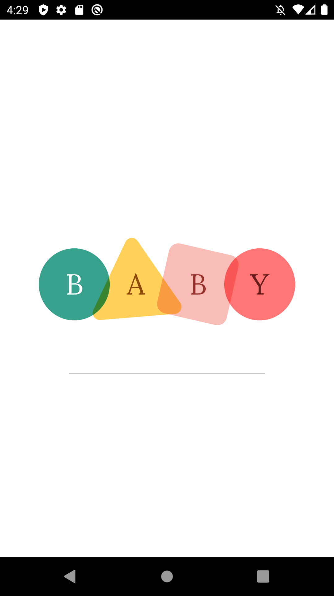

<h1>Android Developer - About Me<h1/>
\In my spare time I like to play video games, read fantasy books, make games with [MonoGame](https://www.monogame.net/), and spend time with my family.

I'm an ever learning developer. At some point back in time I've learned I can do anything I set my mind to. All I need is google! Often when I write code, hours go by unoticed.

# Projects:
## BabyApp
This is the project I am currently working on. I am learning a lot working with my brother, an experienced designer. It is currently a private repository and will likely stay that way but I will be putting it on the Play Store when we are done. For now you have the loading screen!

## Community Calendar
You can find the repository [here](https://github.com/Lambda-School-Labs/community-calendar-android). This was a remote project done with a team that has Android, Web, and iOS counterparts. I was on the Android team and used many libraries on the project.
Android libraries: Apollo-Android, NavComponent, Picasso, OkHttp, Koin, RxJava2, Room, Moshi

  

## Snake 1v1
You can find the repository [here](https://github.com/justinbgent/FirstGame). As titled this is a Snake 1v1 game I made using C# in MonoGame, a library made to work like Microsoft’s XNA. I like to play with it every now and then. If you download it you may run into multiple files named "CalebsIdea". This is because my nephew Caleb came up with the idea and I figured I'd make it!

