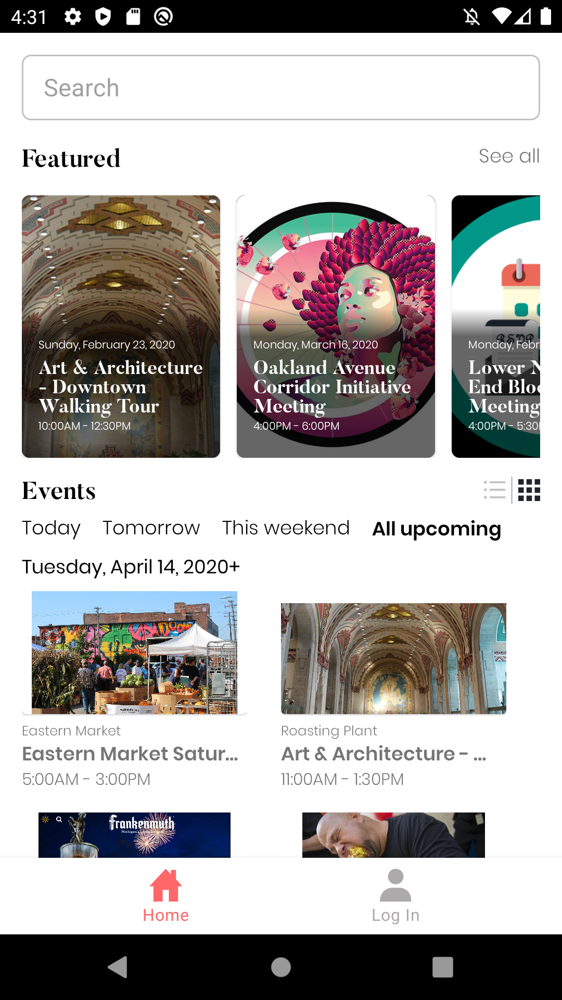
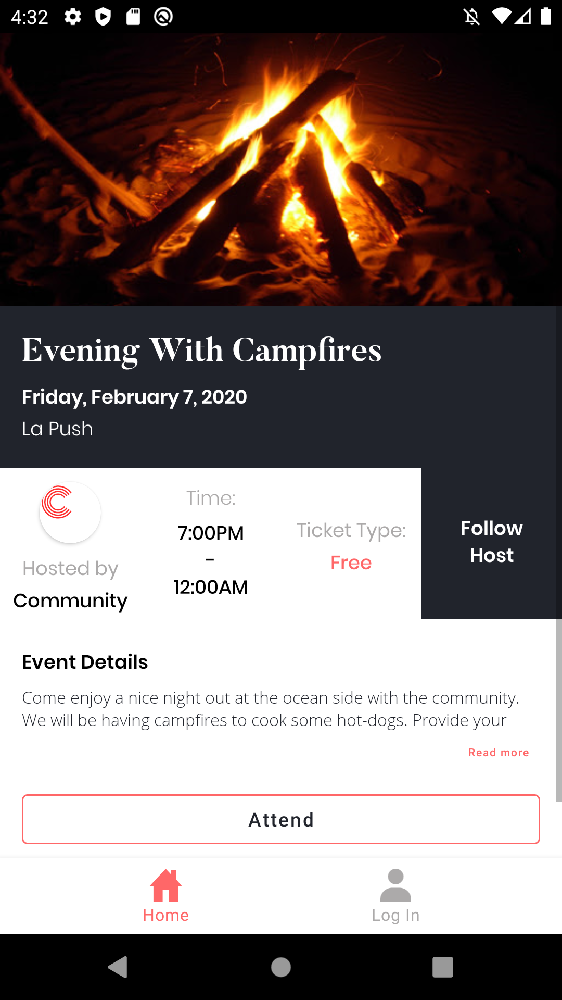
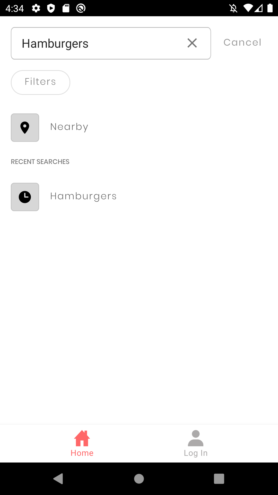
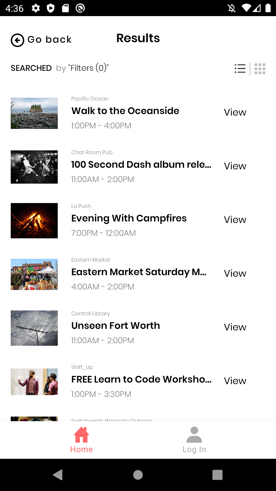
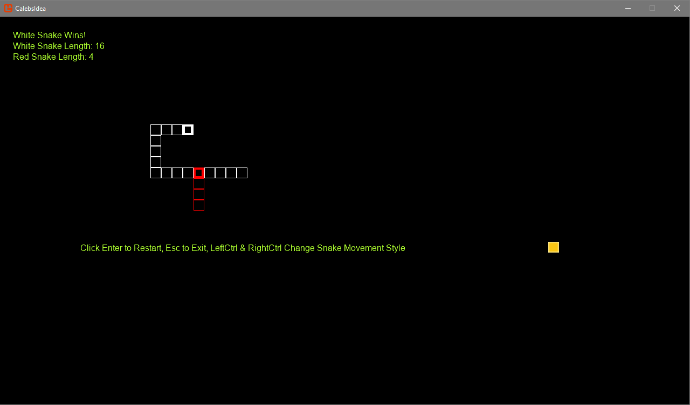

<h1>Android Developer - About Me</h1>
In my spare time I like to go on dates, socialize with friends & family, create video games, read books, and play games.

I'm an ever learning programmer. I've found I can do anything I set my mind to. I'll admit, Google helps out a lot! Often when I write code, hours go by unoticed.

# Skills:
Android Studio, Visual Studio, GitHub, Kotlin, Java, C#, Python, Java Spring, REST APIs, Mvvm, Room, Retrofit, Debugging, RxJava, Dagger, GraphQL, ApolloAndroid, NavComponent, Picasso

# Contact
- LinkedIn: https://www.linkedin.com/in/justinbgent/
- GitHub: https://github.com/justinbgent
- Email: justinbgent@gmail.com

# Projects:
## Rekor Blue (Not Owned by Me)
[This](https://play.google.com/store/apps/details?id=ai.rekor.rekorblue) is the project I am currently working on at Rekor.

## Split Inertia
Split Inertia is a fast paced online multiplayer video game I am building in Unity. I can't help but mention, multiplayer UDP oriented code may be the most challenging thing I've ever worked on. Nonetheless, this hobby project shared with my brother Kevin, is a ton of fun to create. Note I am the one programming the game mechanics and Kevin does all of the visual magic. [Here's](http://www.kevingent.com/p_si.html) Kevin's portfolio showing the game if you'd like to see some visuals!

## Community Calendar
You can find the repository [here](https://github.com/Lambda-School-Labs/community-calendar-android). The goal of the app is to help community members conveniently find upcoming events. This was a remote project done with a team that had Android, Web, and iOS counterparts. I was on the Android team and used many libraries on the project. I primarily developed the functionality of the home, event details, and search screens.
Android libraries: Apollo-Android, NavComponent, Picasso, OkHttp, Koin, RxJava2, Room, Moshi

  

## Game Engine in MonoGame
This is quite a hobby project. When I need a break from other projects I come here. It is a ton of fun every time. I've built collision boxes for sprites I can move around the screen. It handles rectangle, circle, and triangle collisions in which I admit each took me some time to figure out. Lots of algebra and geometry. I am currently working on a map editor for it. Github says it has reached 12,500+ lines of code via commits.

## Snake 1v1
You can find the repository [here](https://github.com/justinbgent/FirstGame). As titled this is a Snake 1v1 game I made using C# in MonoGame, a library made to work like Microsoft’s XNA. I like to play with it every now and then. If you download it you may run into multiple files named "CalebsIdea". This is because my nephew Caleb came up with the idea and I figured I'd make it!

